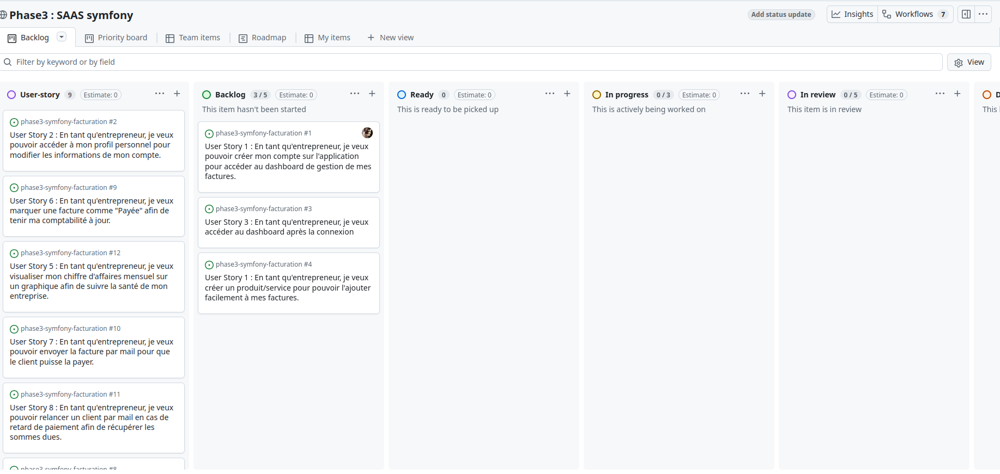

# Phase3 : SAAS Symfony — Facturation

Une application de facturation (SaaS) développée avec Symfony permettant de gérer les clients, produits/services, factures, envois par e‑mail, relances et tableaux de bord statistiques.

**Project board:** https://github.com/users/Gaetan1303/projects/8/views/1

## Description

Ce projet a pour objectif de fournir une application simple et extensible de gestion de facturation destinée aux entrepreneurs : création et envoi de factures, suivi des paiements, relances automatiques et visualisation du chiffre d'affaires.

Le code est construit autour du framework Symfony (8.x) avec Doctrine ORM pour la persistance, Twig pour les templates et un petit front basé sur Stimulus / Tailwind pour l'interactivité.

## Fonctionnalités (visibles / attendues)
- Gestion des utilisateurs et accès au tableau de bord
- Création de produits / services
- Création et envoi de factures par e‑mail
- Marquage des factures comme « Payée »
- Relances clients par e‑mail
- Tableaux de bord et graphiques de CA mensuel (Chart.js)
- Génération/Export PDF (Gotenberg)

Ces éléments ont été déduits du code et des dépendances présentes dans le dépôt (voir la section Analyse ci‑dessous).

## Stack technique
- PHP >= 8.4
- Symfony 8 (Framework, Security, Mailer, Messenger, UX)
- Doctrine ORM + Migrations
- Twig
- Tailwind / Symfonycasts Tailwind bundle
- Chart.js (via Symfony UX)
- Gotenberg (bundle) pour génération de PDF
- SendGrid pour l'envoi d'e-mails
- PHPUnit pour les tests

## Installation rapide

Prérequis : PHP 8.4+, Composer, Docker (optionnel), Node.js/npm (si rebuild des assets)

1. Cloner le dépôt

	git clone <votre-url-git>
	cd phase3-symfony-facturation

2. Copier le fichier d'environnement et configurer les variables (ex. `DATABASE_URL`, `SENDGRID_API_KEY`)

	cp .env .env.local

3. Installer les dépendances PHP

	composer install --no-interaction --prefer-dist

4. Démarrer la base de données et services (option Docker)

	docker compose -f compose.yaml up -d

5. Appliquer les migrations Doctrine

	php bin/console doctrine:migrations:migrate
    'attention, si vous utilisez un docker, il faut lancer les commandes à l'intérieur du conteneur (ex. `docker exec -it <container_name> bash` pour accéder au terminal du conteneur)'

6. Lancer le serveur PHP (ou `symfony server:start` si vous utilisez l'outil Symfony)

	symfony server:start --no-tls -d

7. Lancer la suite de tests

	php bin/phpunit

## Analyse rapide du projet

- Structure: répertoires `src/Controller`, `src/Entity`, `src/Repository` — architecture standard MVC + Doctrine.
- Dépendances clefs: `doctrine/orm`, `symfony/mailer` (SendGrid), `sensiolabs/gotenberg-bundle` (PDF), `symfony/ux-chartjs` (graphes), `symfonycasts/tailwind-bundle`.
- Tests: PHPUnit est installé en dev (`phpunit/phpunit ^13`).
- Scripts Composer: `auto-scripts` configurés pour `cache:clear`, `assets:install` et `importmap:install`.

## Contact

- Tableau du projet: https://github.com/users/Gaetan1303/projects/8/views/1
- Profil GitHub: https://github.com/Gaetan1303

---
