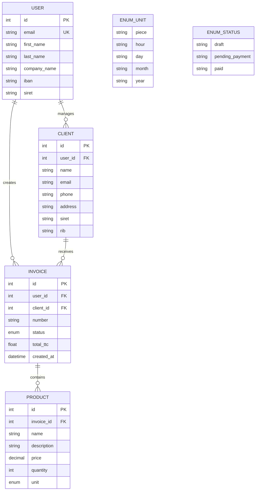

```mermaid
erDiagram
USER ||--o{ INVOICE : creates
USER ||--o{ CLIENT : manages
CLIENT ||--o{ INVOICE : receives
INVOICE ||--o{ PRODUCT : contains
INVOICE {
    int id PK
    int user_id FK
    int client_id FK
    string number
    enum status
    float total_ttc
    datetime created_at
}
USER {
    int id PK
    string email UK
    string first_name
    string last_name
    string company_name
    string iban
    string siret
}
CLIENT {
    int id PK
    int user_id FK
    string name
    string email
    string phone
    string address
    string siret
    string rib
}
PRODUCT {
    int id PK
    int invoice_id FK
    string name
    string description
    decimal price
    int quantity
    enum unit 
}

ENUM_UNIT {
    string piece
    string hour
    string day
    string month
    string year
}

ENUM_STATUS {
    string draft
    string pending_payment
    string paid
}

```