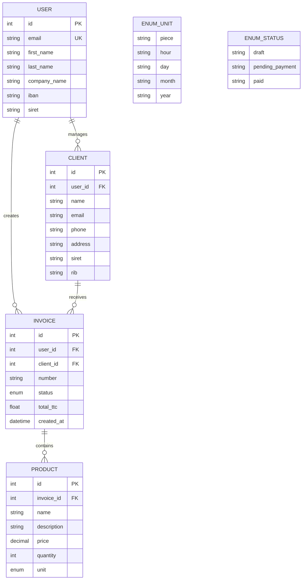

# Facturation SaaS - User Stories

## Objectif pédagogique : le CRUD, les relations SQL simples et l'authentification.

## Lien du répo GitHub original du projet :
https://github.com/CHAOUCHI/phase3-symfony-facturation

## Critères d'évaluation :
|Critères|Description|
|-|-|
|MVP|Epic 1 Espace utilisateur & Epic 2 Facturation |
|Respect de la maquette |
|   Implémentation du diagramme UML pour la BDD|
| Mise en place des issues GitHub pour chaque User Story | Chaque User Story doit être créée en tant qu'issue GitHub avec les critères d'acceptation clairement définis |
| Authorization | Routes privées et publiques|
| Readme.md Documenter le déploiement | Rédigez un Readme qui explique comment lancer l'application à partir d'un serveur ou d'un PC neuf |
|BONUS| Les epics 3 & 4 sont des objectifs bonus optionnels|

## Cahier des charges fonctionnel

### Synopsis
Une application de facturation simpliste à destination des auto-entrepreneurs. Elle permet de suivre son chiffre d'affaires et générer des factures PDF. 

Pas de gestion d'employés nécessaire.

À terme le logiciel permettrait de faire payer les clients directement depuis l'application, cependant cette fonctionnalité n'est pas prioritaire car la plupart des clients effectuent un virement directement sur le compte bancaire présent dans la facture.

### Maquette

#### Maquette statique :
https://www.figma.com/design/tZNL1SBsO5OKWfgpCTJhiY/Sass-facturation?node-id=14-2143&t=yX9R9gCzpx9NKdOA-1
#### Maquette interactive :
https://www.figma.com/proto/tZNL1SBsO5OKWfgpCTJhiY/Sass-facturation?node-id=14-2143&t=u0yucPsp3yd38TGT-1&scaling=min-zoom&content-scaling=fixed&page-id=0%3A1&starting-point-node-id=14%3A2143&show-proto-sidebar=1

### Résumé des fonctionnalités : 
- Créer un compte.
- Se connecter et se déconnecter.
- Accéder à un profil utilisateur pour modifier les informations de son compte.
- Dashboard des (bonus) statistiques de vente et Navigation vers les différentes sections de l'application.
- Créer, modifier et supprimer des produits/services.
- Créer, modifier et supprimer des clients.
- Créer une facture en associant des produits/services et un client.
- Voir la liste de ses factures avec les informations clés et filtrer par statut.
- Voir les détails d'une facture.
- Générer une facture PDF à partir d'une facture validée.
- Marquer une facture comme "Payée".
- (bonus) Envoyer une facture par mail au client.
- (bonus) Relancer un client par mail en cas de retard de paiement.

### Précisions cas critiques :
- Seule une facture en brouillon peut être modifiée ou supprimée, une fois validée elle ne peut plus être modifiée ou supprimée pour des raisons de traçabilité comptable
- Les utilisateurs ne peuvent accéder qu'à leurs propres données (factures, clients, produits)

### MVP Epic 1 : Espace utilisateur

- User Story 1 : En tant qu'entrepreneur, je veux pouvoir **créer mon compte sur l'application** pour accéder au dashboard de gestion de mes factures.
    - CA 1 : Je dois fournir email, mot de passe, raison sociale et IBAN, nom et prénom pour créer mon compte
    - CA 2 : Je peux me déconnecter pour fermer ma session
    - CA 3 : Je suis déconnecté automatiquement au bout d'une heure.

- User Story 2 : En tant qu'entrepreneur, je veux pouvoir **accéder à mon profil personnel** pour modifier les informations de mon compte.
    - CA 1 : Je peux accéder à mon profil depuis un lien dans le menu de navigation.
    - CA 2 : Je peux modifier mon IBAN pour définir le compte bancaire qui recevra les virements de mes clients.
    - CA 3 : Je peux modifier ma raison sociale (le nom de mon entreprise)
- User Story 3 : En tant qu'entrepreneur, je veux **accéder au dashboard après la connexion** pour y retrouver un résumé de mes factures et de mon chiffre d'affaires et des boutons de navigation vers les différentes sections de l'application (factures, clients, produits, statistiques).

### MVP Epic 2 : Facturation 
Un système de facturation basique qui permet de créer des factures, les associer à des clients et des produits, et suivre leur statut (brouillon, validée, payée).

- User Story 1 : En tant qu'entrepreneur, je veux **créer un produit/service** pour pouvoir l'ajouter facilement à mes factures.
    - CA 1 : Je peux créer un produit/service en fournissant un nom, une description et un prix unitaire et unité de mesure (heure, jour, pièce).
    - CA 2 : Je peux voir la liste de tous mes produits/services dans une section dédiée de l'application.
    - CA 3 : Je peux modifier ou supprimer un produit/service de mon catalogue.

- User Story 2 : En tant qu'entrepreneur, je veux **ajouter un client** pour pouvoir lui associer mes factures.
    - CA 1 : Je peux créer un client en fournissant son nom, son adresse, son email, son numéro de téléphone, son SIRET (optionnel) et son RIB.
    - CA 2 : Je peux voir la liste de tous mes clients dans une section dédiée de l'application.
    - CA 3 : Je peux modifier ou supprimer un client de mon répertoire.

- User Story 2 : En tant qu'entrepreneur, je veux **créer une facture détaillée** pour un client afin de lui proposer une prestation.
Critères d'acceptation :
    - CA 1 : Je peux ajouter des lignes de produits/services.
    - CA 2 : Le total de la facture est calculé automatiquement en fonction des lignes ajoutées.
    - CA 3 : L'utilisateur doit choisir un client existant ou en créer un nouveau pour associer la facture.
    - CA 4 : Je peux enregistrer la facture en brouillon pour la compléter plus tard.
    - CA 5 : Je peux valider la facture une fois qu'elle est complète pour la rendre non modifiable et la préparer à l'envoi au client.
    - CA 6 : Je peux supprimer une facture tant qu'elle est en brouillon, une fois validée elle ne peut plus être supprimée pour des raisons de traçabilité comptable.
    - CA 7 : Une facture possède un numero unique au format "FACT-YYYYMMDD-N" ou N est le competeur de facture faite dans le mois en cours (ex: FACT-20240115-5 pour la 5ème facture créée en janvier 2024)

- User Story 3 : En tant qu'entrepreneur, je veux pouvoir **voir la liste de mes factures** pour suivre l'état de mes ventes.
Critères d'acceptation :
    - CA 1 : Je peux voir la liste de toutes mes factures avec les informations clés (numéro, client, montant total, statut).
    - CA 2 : Je peux filtrer les factures par statut (en attente de paiement, payée) pour faciliter le suivi.
    - CA 3 : Je peux cliquer sur une facture pour voir les détails de celle-ci (lignes de produits/services, informations du client).

- User Story 3 : En tant qu'entrepreneur, je veux **transformer une facture validée en facture PDF** en un seul clic afin de pouvoir la télécharger et l'envoyer au client moi-même.
Critères d'acceptation :
    - CA 1 : Seule une facture validée peut être transformée en facture PDF.
    - CA 2 : La facture PDF doit inclure en bas de page les conditions générales de vente (CGV) de l'entreprise, le SIRET et les conditions de paiement.

- User Story 4 : En tant qu'entrepreneur, je veux **marquer une facture comme "Payée"** afin de tenir ma comptabilité à jour.
Critères d'acceptation :
    - CA 1 : Je peux marquer une facture comme "Payée" en un clic.
    - CA 2 : Une fois la facture marquée comme "Payée", elle ne peut plus être modifiée.
    - CA 3 : Les factures "Payées" sont affichées dans une section distincte de celles "En attente de paiement" pour faciliter le suivi.
    - CA 4 : Je veux un message de confirmation avant de marquer une facture comme "Payée" pour éviter les erreurs.

### Epic 3 : Emailing

- User Story 7 : En tant qu'entrepreneur, je veux pouvoir **envoyer la facture par mail** pour que le client puisse la payer.
    - CA 1 : Le mail utilisé pour l'envoi de la facture est celui du client associé à la facture.
    - CA 2 : Le mail contient la facture en pièce jointe au format PDF.

- User Story 8 : En tant qu'entrepreneur, je veux pouvoir **relancer un client par mail** en cas de retard de paiement afin de récupérer les sommes dues.
Critères d'acceptation :
    - CA 1 : Je peux envoyer un email de relance directement depuis l'interface via un bouton "Relancer" associé à chaque facture en attente de paiement.
    - CA 2 : L'email de relance doit inclure la facture concernée en pièce jointe au format PDF et l'IBAN de l'entreprise pour faciliter le paiement.
    - CA 3 : Je veux pouvoir personnaliser le message de relance avant de l'envoyer.

### Epic 4 : Statistiques

- User Story 5 : En tant qu'entrepreneur, je veux **visualiser mon chiffre d'affaires mensuel sur un graphique** afin de suivre la santé de mon entreprise.
Critères d'acceptation :
    - CA 1 : Le graphique affiche le chiffre d'affaires total pour chaque mois de l'année en cours.
    - CA 2 : Je peux filtrer le graphique par année pour comparer les performances d'une année à l'autre.
    - CA 3: Le chiffre d'affaires est calculé en faisant la somme des montants des factures "Payées" pour chaque mois.
    - CA 4 : Je veux pouvoir voir le CA mensuel ou annuel en fonction de la période sélectionnée pour une analyse plus détaillée.
    - CA 5 : Le graphique représente le chiffre d'affaires via un graphique en barre avec le temps sur l'axe des x et le montant du chiffre d'affaires sur l'axe des y.

## Cahier des charges non fonctionnel (technique et implémentation)

## UML

### EntityRelation

## Extensions recommandées pour le projet
- UX ChartJS pour le graphique de l'epic 4: https://symfony.com/bundles/ux-chartjs/current/index.html
- Symfony Mailer pour l'envoi de mails de l'epic 3 : https://symfony.com/doc/current/mailer.html